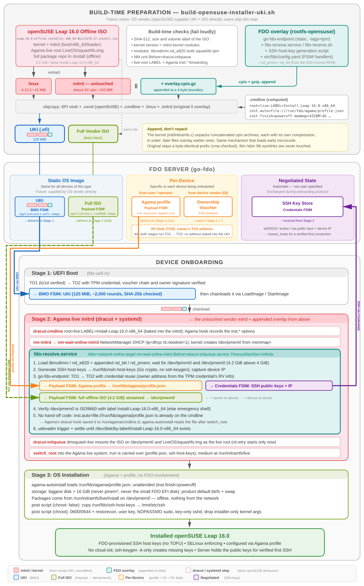

# openSUSE Leap 16.0 (Agama) Installer (FDO UKI)

[← Overview](README.md) · Test results: [TEST-OPENSUSE-UKI.md](TEST-OPENSUSE-UKI.md) · Work tracker: [TODO-OPENSUSE-UKI.md](TODO-OPENSUSE-UKI.md)



## Building and Testing

The openSUSE path builds a UKI from the **openSUSE Leap 16.0 offline installer** ISO. That's a kiwi-built Agama live ISO which also carries the full package repository, so nothing is installed from the network. For the full picture, see the [openSUSE architecture diagram](doc/fdo-uki-opensuse-architecture.svg) and [Theory of Operation](#theory-of-operation).

```bash
GO_ROOT=/path/to/go1.25 ./build-opensuse-installer-uki.sh
```

The script:

1. Downloads and verifies the pinned ISO (SHA-512, size, label; config in `config/opensuse-installer.env`).
2. Extracts `boot/x86_64/loader/{linux,initrd}`.
3. Takes `nd_pmem`/`nd_btt`, which the stock initrd lacks, from the ISO's own kernel package.
4. Appends the FDO overlay from `rootfs-opensuse/` to the untouched initramfs.
5. Reserves `/dev/pmem0`, and builds:

```text
firmware/opensuse-leap-16.0-fdo.efi
```

Extra host tools beyond the Fedora list: `sha512sum`, `bzip2`, `zstd`, `python3` (used to read the RPM payload, so no `rpm2cpio` is needed).

```bash
DEPLOY=1 DEPLOY_HOST=<hostname> ./build-opensuse-installer-uki.sh
./test-opensuse-installer.sh   # on the test host (QEMU defaults: 16 GiB, -cpu max)
```

The server delivers the Agama profile (`config/agama-profile-test.json`) as `application/vnd.opensuse.agama+json` before the ISO, and the ISO as `application/x-iso9660-image`. As with Fedora, the harness registers a TO0 blob.

**Verified end to end in QEMU on 2026-10-05:**

- TO1/TO2 in both stages
- BMO of the 125 MiB UKI
- the 4.2 GiB ISO streamed to `/dev/pmem0`
- an unattended Agama install from the offline repo (~28 min total)
- the installed `fdo-installed` system has SSH host keys byte-identical to the FDO-registered keys, passes strict host-key checking with no TOFU, and runs SELinux enforcing

See `TEST-OPENSUSE-UKI.md` for findings, the two run-time fixes (`-cpu max`; stripping installer-only kernel args), and timings, and `TODO-OPENSUSE-UKI.md` for remaining work.

## Theory of Operation

This section is the reference for the openSUSE path, laid out like the [Fedora one](README-FEDORA.md#theory-of-operation). The diagram reads top to bottom in the same order, with the same colours, chips and trace lines. The FDO side is unchanged: TO1/TO2 in both stages, BMO, Payload FSIM, Credentials FSIM, credential reuse, and a TO0-registered rendezvous blob. What's different is that Leap 16 replaced YaST/AutoYaST with **Agama**, and its offline installer is a **live system**.

### At a Glance

- **Build time:** extract the kernel and initrd from the Leap 16.0 offline ISO. Leave the initrd untouched and append a small cpio containing:
  - go-fdo-endpoint, its config, and `fdo-receive.service`
  - **`nd_pmem` + `nd_btt`**, which the stock kiwi initrd lacks and are taken from the ISO's own signed `kernel-default` RPM

  Pack it all into one 125 MiB UKI.
- **Server:** UKI (BMO), offline ISO (Payload), **Agama profile** (Payload, `application/vnd.opensuse.agama+json`, sent first), voucher, RV blob.
- **Stage 1 (UEFI):** TO1 → TO2 → BMO → chainload, exactly as for the other distros.
- **Stage 2 (initrd):** `fdo-receive.service` runs between NM-online and `dracut-initqueue`, as on Fedora. It loads the appended pmem modules, generates SSH host keys, runs TO1 → TO2, receives the profile into `/run/fdo/agama/profile.json`, streams the ISO into `/dev/pmem0`, and returns the SSH keys. dmsquash-live then mounts the **live root** from `/dev/pmem0` using the label baked into the initrd.
- **Stage 3 (Agama):** `agama-autoinstall` reads the profile named by `inst.auto=` and installs unattended from the ISO's `/install` repo. Post scripts copy the FDO host keys, label them for SELinux, finish the hardening, then power off.

### Ubuntu → Fedora → openSUSE mapping

| Concern | Ubuntu | Fedora | openSUSE Leap 16 |
| --- | --- | --- | --- |
| Kernel / initrd on ISO | `/casper/vmlinuz`, `/casper/initrd` | `/images/pxeboot/…` | `/boot/x86_64/loader/{linux,initrd}` |
| Installer runtime | casper + squashfs, Subiquity | Anaconda stage2 `install.img`, repo `/Packages` | **Agama live system** `LiveOS/squashfs.img`, repo `/install` |
| Initramfs | initramfs-tools (busybox, `ORDER`) | dracut + systemd | dracut + systemd (kiwi live) |
| Initrd modification | unpack, edit, repack | append one gzip cpio | append one gzip cpio (**+ `nd_pmem`, `nd_btt`**) |
| FDO hook | `casper-premount/20fdo-receive` | `fdo-receive.service` before `dracut-initqueue` | same as Fedora |
| Media argument | `live-media=/dev/pmem0` | `inst.repo=hd:LABEL=…` | `root=live:LABEL=Install-Leap-16.0-x86_64` (also baked into the initrd) |
| Unattended config | autoinstall YAML → `/autoinstall.yaml` | kickstart → `/run/install/ks.cfg` (Anaconda hand-off) | Agama JSON → `/run/fdo/agama/profile.json` via `inst.auto=file://…` (**no hand-off**) |
| MIME type | `application/vnd.canonical.autoinstall+yaml` | `application/vnd.fedora.kickstart` | `application/vnd.opensuse.agama+json` |
| Disk selection | `layout: direct` | `%pre` → `%include` | `storage.drives[].search`: biggest, `size > 16 GiB` |
| SSH key copy | late-commands | `%post --nochroot` + `restorecon` | post script (`chroot:false`, target at `/mnt`) + chroot `restorecon` |
| Key regeneration guard | cloud-init drop-in | none needed | none needed (`ssh-keygen -A` only creates missing keys) |
| LSM | AppArmor | SELinux enforcing | **SELinux enforcing** (new in Leap 16) |
| CPU baseline | x86-64 | x86-64 | **x86-64-v2** (QEMU: `-cpu max`) |
| ISO / pmem / QEMU RAM | 2.7 GiB / 2796 MiB / 8 GiB | 3.6 GiB / 3732 MiB / 12 GiB | 4.2 GiB / 4328 MiB / 16 GiB |

### Build Steps (`build-opensuse-installer-uki.sh`)

1. **Fetch and verify** the pinned ISO: SHA-512, size, and label `Install-Leap-16.0-x86_64`.
2. **Extract** `boot/x86_64/loader/{linux,initrd}`, `boot/grub2/grub.cfg` and `LiveOS/.info`. Check that the ISO is an offline Agama image: `LiveOS/squashfs.img`, `install/repodata`.
3. **Inspect the initrd (read-only).** It's a single XZ cpio; extract a handful of files and check:
   - the kernel version matches
   - the required modules are present: `libnvdimm`, `nd_e820`, `isofs`, `squashfs`, `overlay`, `loop`, TPM, `virtio_net`
   - `nm-wait-online-initrd` is still `Before=dracut-initqueue`
   - `etc/cmdline.d/10-liveroot.conf` is `root=live:LABEL=<label>`
   - Agama's dracut hook still forwards `inst.*` options

   Two quirks: `usr/lib/dracut/hooks` is a symlink to `var/lib/dracut/hooks` here, and `os-release` is kept for `.osrel`.
4. **Missing modules.** For each of `nd_btt` and `nd_pmem` that the initrd lacks:
   - locate the ISO's `kernel-default-<kver>.x86_64.rpm`
   - read its payload with a small Python RPM reader (bzip2/xz/zstd/gzip detected from the magic bytes)
   - extract and decompress the `.ko`
   - check `vermagic` = initrd kernel
   - stage it in `usr/lib/fdo/modules/`

   The modules are signed by SUSE, like everything else in the kernel package.
5. **Stage the overlay** (as Fedora: config, unit, script, keygen, static endpoint, label substitution, `initrd.target.wants` symlink, usrmerge guard). Then **append** it with the `cmp` and listing self-checks.
6. **Command line:** `root=live:LABEL=… rd.live.image inst.auto=file:///run/fdo/agama/profile.json inst.finish=poweroff inst.self_update=0 systemd.unit=multi-user.target ip=dhcp rd.neednet=1 memmap=4328M!4G nokaslr console=tty0 console=ttyS0`. `systemd.unit=multi-user.target` runs Agama headless, without the local browser UI.
7. **UKI** with the same objcopy layout as the other builders.

### Why `nd_pmem` has to be added

Ubuntu's and Fedora's installer initrds carry broad driver sets. The kiwi-built Agama initrd is leaner: it has `libnvdimm` and `nd_e820`, which create the persistent-memory *region* from `memmap=`, but not `nd_pmem`, the driver that turns the region into the `/dev/pmem0` block device. The build takes the module and its one dependency, `nd_btt`, from the same kernel build on the same ISO. It keeps the original initrd byte-identical, and loads them with `insmod` from `fdo-receive.sh`; `modprobe` is tried first, in case a future initrd ships them. No `modules.dep` regeneration is needed.

### Profile pickup: no hand-off needed

Fedora needed code to hand a runtime-delivered kickstart to Anaconda. Agama needs none:

1. Agama's dracut cmdline hook (`99-agama-cmdline-conf.sh`) copies every `inst.*` argument into `/run/agama/cmdline.d/agama.conf` early in the initrd.
2. After switch-root, `agama-autoinstall` reads `inst.auto` from there and fetches the URL.
3. With `inst.auto=file:///run/fdo/agama/profile.json` on the UKI cmdline, the file only has to exist by the time Agama starts.

`fdo-receive.service` guarantees that, because it finishes before the live root is even mounted, and `/run` survives switch-root. Agama finds the offline package repo on its own (`/run/initramfs/live/install`, the live medium on `/dev/pmem0`). `inst.self_update=0` keeps it from looking online for installer updates.

### Agama profile details (`config/agama-profile-test.json`)

- **Validated against the exact Agama 16.0 schemas** shipped in the live root (`/usr/share/agama-cli/*.schema.json`). The Agama 16.0 CLI can't validate offline (it needs a running Agama server). Some newer documented options are not in 16.0: `user.sshPublicKey`, and `and`/`or`/`not` in storage searches.
- **Disk selection:** `storage.drives[0].search` = biggest drive with `size > 16 GiB`, `max: 1`, `ifNotFound: error`. Existing partitions are deleted, then the product's default layout is generated (btrfs with snapshots, plus swap). This rules out `/dev/pmem0` (~4.2 GiB) and the 64 MiB FDO EFI disk.
- **Post script, `chroot: false`** (in the live system, target at `/mnt`): copy `/run/fdo/ssh-host-keys/ssh_host_*` → `/mnt/etc/ssh/`.
- **Post script, `chroot: true`:**
  - set key ownership and modes
  - install the `fdo` user's `authorized_keys`
  - write the NOPASSWD sudoers drop-in and `sshd_config.d/10-fdo.conf` (key-only)
  - enable sshd, and open ssh in firewalld
  - **`restorecon`** the keys, sudoers and `~/.ssh` (SELinux is enforcing on Leap 16)
  - strip installer-only kernel args (below)
  - write the completion marker
- **Installer kernel args leak into the installed system.** Agama copies the installer's kernel command line into the installed GRUB config. Left alone, the installed system would boot with `memmap=4328M!4G` and permanently lose 4.2 GiB of RAM to a fake pmem disk; that's exactly what run 1 showed. The chroot post script removes `memmap=`, `nokaslr` and `systemd.unit=` from `GRUB_CMDLINE_LINUX_DEFAULT` and runs `update-bootloader --refresh`.

### Runtime Flow (openSUSE)

Timings are from the verified QEMU run (TCG, `-cpu max`).

1. **Stage 1:** TO1 (to1d verified) → TO2 → BMO of the 125 MiB UKI (~1 min) → chainload.
2. **Boot:** the kernel creates the pmem region from `memmap=`. Agama's dracut hook records the `inst.*` options. NetworkManager brings up DHCP.
3. **Onboarding:** `fdo-receive.service`:
   - loads `nd_btt`/`nd_pmem`, so `/dev/pmem0` appears at the ISO's exact size
   - generates SSH host keys
   - runs TO1 → TO2, receiving the profile and then the ISO (~8.4 min) while returning the SSH keys and IP
   - checks the ISO type and label, and waits for `/dev/disk/by-label/Install-Leap-16.0-x86_64`. On this hybrid-GPT ISO the link points at `pmem0p2`, the ISO partition, which mounts fine.
4. **Live root:** `dracut-initqueue` → dmsquash-live mounts `LiveOS/squashfs.img` from the medium, and switch-root takes the system into the Agama live system.
5. **Install:** `agama-autoinstall` loads the profile and installs from `/run/initramfs/live/install`. It runs the post scripts and powers off (~28 min total).
6. **Result:** `fdo-installed login:`. The installed system has the FDO-registered host keys and SELinux enforcing, and the installer-only kernel args are removed.

### openSUSE-specific gotchas

- **x86-64-v2:** Leap 16 userspace needs SSE4.2 and POPCNT. QEMU's default TCG CPU makes init die with an invalid-opcode trap (`pinsrq`), so the harness uses `-cpu max`. Real hardware is fine.
- **Live installer exposure:** while Agama runs, the live system shows a random root password on the console and serves the Agama web UI and sshd. That's harmless for a lab VM, but worth locking down for production (see `TODO-OPENSUSE-UKI.md`).
- **Serial console:** in headless mode (`multi-user.target`) the serial console stays at a login prompt during the install. Watch the target disk grow, or wait for `reboot: Power down`.

## Files

- `build-opensuse-installer-uki.sh` — openSUSE Leap 16 offline (Agama live) installer UKI build (appends FDO overlay + `nd_pmem`/`nd_btt`)
- `test-opensuse-installer.sh` — End-to-end openSUSE test: TPM init, FDO server, TO0, QEMU (`-cpu max`), Agama profile, verification
- `config/opensuse-installer.env` — Pinned Leap ISO URL, SHA-512, size, label, profile MIME, UKI filename
- `config/agama-profile-test.json` — Test Agama profile (hostname, user, disk search, key copy, hardening, kernel-arg cleanup)
- `rootfs-opensuse/` — Overlay files appended to the openSUSE initramfs:
  - `etc/fdo/config.yaml` — Endpoint FSIM config (profile + ISO destinations)
  - `usr/lib/systemd/system/fdo-receive.service` — Runs FDO onboarding between network-online and dracut-initqueue
  - `usr/libexec/fdo/fdo-receive.sh` — pmem modules, keygen, TO2, media validation (no hand-off needed)
- `doc/fdo-uki-opensuse-architecture.svg` — Architecture diagram (openSUSE Leap 16 / Agama)
- `TEST-OPENSUSE-UKI.md` — openSUSE discovery findings, build verification, E2E runs
- `TODO-OPENSUSE-UKI.md` — openSUSE phased work tracker
