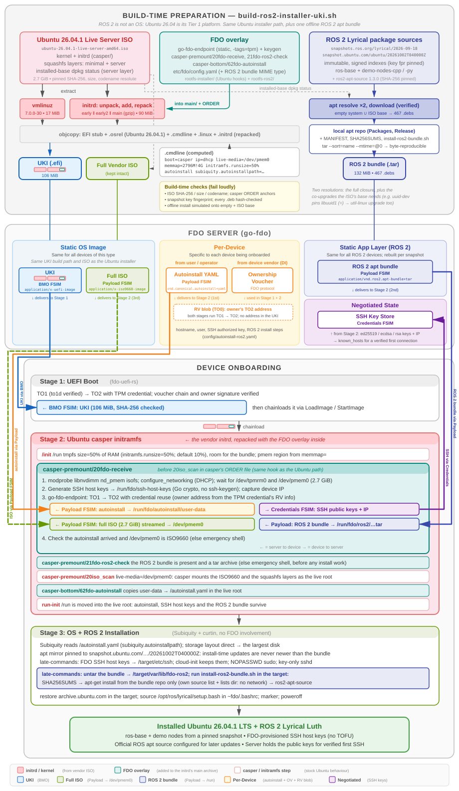

# ROS 2 Lyrical Luth Installer (Ubuntu 26.04.1 + offline ROS 2 bundle, FDO UKI)

[← Overview](README.md) · Test results: [TEST-ROS2-UKI.md](TEST-ROS2-UKI.md) · Work tracker: [TODO-ROS2-UKI.md](TODO-ROS2-UKI.md)



## Building and Testing

ROS 2 is not an operating system. Its Tier 1 platform for **ROS 2 Lyrical Luth** (May 2026) is Ubuntu 26.04 "resolute" amd64, the same release as the [Ubuntu path](README-UBUNTU.md). So the device installs the same pinned Ubuntu 26.04.1 live-server ISO, and the owner sends **one more `fdo.payload`**: a tar holding a local apt repository with every package ROS 2 needs. The autoinstall installs ROS 2 from it with no network access. For the full picture, see the [ROS 2 architecture diagram](doc/fdo-uki-ros2-architecture.svg) and [Theory of Operation](#theory-of-operation).

```bash
GO_ROOT=/path/to/go1.25 ./build-ros2-installer-uki.sh
```

The script:

1. Verifies the Ubuntu ISO (pins shared with `config/ubuntu-installer.env`) and extracts the kernel, the initrd, and the dpkg status of the default install source (the `ubuntu-server` squashfs layer).
2. Resolves `ros-lyrical-ros-base`, `ros-lyrical-demo-nodes-cpp` and `ros-lyrical-demo-nodes-py` against **immutable snapshots** (`snapshots.ros.org/lyrical/2026-09-18` and `snapshot.ubuntu.com/ubuntu/20261002T040000Z`), downloads the result with signature/hash verification, and packs a reproducible bundle (467 packages, 132 MiB). Config: `config/ros2-installer.env`.
3. Simulates an offline install from the bundle onto an empty system and onto the ISO's installed base. The build fails if either can't be satisfied.
4. Builds the UKI the Ubuntu way (unpack, add `rootfs-installer/` + `rootfs-ros2/`, patch casper's `ORDER`, repack).

```text
firmware/ubuntu-26.04.1-ros2-lyrical-fdo.efi
firmware/ros2-lyrical-2026-09-18-bundle.tar
```

Host tools beyond the Ubuntu list: `apt-get`, `apt-ftparchive`, `dpkg-scanpackages`, `dpkg-deb` and `gpg`, so the build host must be Debian/Ubuntu-based. No container or root apt state is used: apt runs in a private directory under `build-ros2/`.

```bash
DEPLOY=1 DEPLOY_HOST=<hostname> ./build-ros2-installer-uki.sh
./test-ros2-installer.sh   # on the test host (QEMU defaults: 8 GiB, -cpu max)
```

The server sends three payloads, in this order: the autoinstall (`config/autoinstall-ros2.yaml`, `application/vnd.canonical.autoinstall+yaml`), the ROS 2 bundle (`application/vnd.ros2.apt-bundle+tar`), and the ISO (`application/x-iso9660-image`). As with Fedora and openSUSE, the harness registers a TO0 blob.

**Verified end to end in QEMU on 2026-10-07:**

- TO1/TO2 in both stages
- BMO of the 106 MiB UKI
- the 132 MiB ROS 2 bundle (~20 s) and the 2.7 GiB ISO (~6.5 min) streamed
- an unattended Subiquity install, with ROS 2 Lyrical installed **offline** from the bundle
- the installed `fdo-ros2` system runs the C++ talker → Python listener demo, has SSH host keys byte-identical to the FDO-registered keys, and passes strict host-key checking with no TOFU, before and after a reboot

See `TEST-ROS2-UKI.md` for findings (including the dependency co-upgrade problem the build now guards against, and a late-command fix), hashes and timings, and `TODO-ROS2-UKI.md` for remaining work.

## Theory of Operation

The diagram uses the same layout, colours, chips and trace lines as the others, with one new colour: **indigo** is the ROS 2 bundle. The FDO side is unchanged: TO1/TO2 in both stages, BMO, Payload FSIM, Credentials FSIM, credential reuse, and a TO0-registered RV blob. The OS side is the Ubuntu path. What's new is how an *application layer* (ROS 2) gets onto the device without the network, reproducibly.

### At a Glance

- **Build time:** the Ubuntu installer UKI, built as before from the 26.04.1 live-server ISO, but with an endpoint config that accepts one more MIME type and one extra premount hook. Separately, an **offline ROS 2 apt bundle**: the dependency closure of the requested ROS packages, resolved and downloaded from pinned snapshots, as a local apt repo in a tar.
- **Server:** UKI (BMO), Ubuntu ISO (Payload), **ROS 2 bundle** (Payload, `application/vnd.ros2.apt-bundle+tar`), autoinstall (Payload, sent first), voucher, RV blob.
- **Stage 1 (UEFI):** TO1 → TO2 → BMO → chainload, as for every distro.
- **Stage 2 (initrd):** `20fdo-receive` is the Ubuntu hook unchanged. It receives the autoinstall, then the bundle into `/run/fdo/ros2/ros2-bundle.tar`, then the ISO into `/dev/pmem0`, and returns the SSH host keys. `21fdo-ros2-check` fails early if the bundle is missing. casper then boots the live installer from `/dev/pmem0`.
- **Stage 3 (Subiquity):** a normal Ubuntu autoinstall, with the install-time apt mirror pinned to the same Ubuntu snapshot. Late-commands unpack the bundle into the target and run its `install-ros2-bundle.sh`, which installs ROS 2 from the bundle's repo only.

### Ubuntu → ROS 2 mapping

| Concern | Ubuntu | ROS 2 (Lyrical) |
| --- | --- | --- |
| ISO, kernel, initrd | 26.04.1 live-server | same ISO (same pins) |
| Initrd overlay | `rootfs-installer/` | `rootfs-installer/` + `rootfs-ros2/` (config with the bundle MIME type, `21fdo-ros2-check`) |
| `.osrel` | build host `/etc/os-release` | the ISO initrd's own `etc/os-release` |
| Endpoint build | default (`CGO_ENABLED` unset) | static (`CGO_ENABLED=0`) |
| Payloads | autoinstall, ISO | autoinstall, **ROS 2 bundle**, ISO |
| `/run` size | 10% of RAM (default) | `initramfs.runsize=50%` (holds the bundle until late-commands) |
| Rendezvous | direct TO2 (old harness) | TO0 blob → TO1 → TO2 (as Fedora/openSUSE) |
| Install-time apt mirror | archive.ubuntu.com (live) | `snapshot.ubuntu.com/…/20261002T040000Z`, restored to archive.ubuntu.com afterwards |
| Extra software | — | ROS 2 from the bundle, offline; `ros2-apt-source` for later updates |
| Hostname | `fdo-installed` | `fdo-ros2` |

### Why a bundle, and why two resolutions

Fedora and openSUSE install offline from repos on their DVDs. The Ubuntu ISO's pool has none of ROS 2, so the packages have to come from somewhere. Options were: online during the install (not reproducible: packages.ros.org changes daily), a custom ISO (breaks "the vendor ISO stays intact"), or **one more payload**. The payload is also exactly the "agent package as its own payload" option of [Putting It All Together](doc/MANAGED-EDGE.md#getting-the-agent-onto-the-device): the owner chooses the application layer per device without rebuilding the OS image.

The bundle must install onto whatever the device has at late-commands time, using only what's in the bundle. The build therefore resolves twice, with host apt in a private apt root:

1. against an **empty** dpkg status: the full dependency closure (457 packages), so every dependency is present whatever the device already has;
2. against the **ISO's installed-base** dpkg status (the `ubuntu-server` layer): this adds the *co-upgrades* a newer library forces on packages that are already installed.

The second resolution was not in the first version. A real offline install in a chroot of the ISO's base failed. `uuid-dev` (from the snapshot) needs `libuuid1 (= 2.41.3-3ubuntu2.2)`, but the base's `util-linux` pre-depends on its own `libuuid1 (= 2.41.3-3ubuntu2)` exactly. So upgrading `libuuid1` also requires the newer `util-linux`, which the empty-system closure never includes because ROS doesn't depend on it. The base resolution finds 22 such co-upgrades (`util-linux`, `mount`, `libmount1`, `python3.14`, …). Ten of them weren't already in the closure, which brings the bundle to 467 packages. The build now simulates the offline install onto both statuses and fails if either can't be satisfied.

The device's base must also not be *newer* than the bundle. Subiquity applies security updates during the install, so the autoinstall pins its mirror (primary and security) to the same Ubuntu snapshot the bundle was resolved against. A late-command points the installed system back at archive.ubuntu.com. The builder checks that the autoinstall really names `UBUNTU_SNAPSHOT_URL`.

### Build Steps (`build-ros2-installer-uki.sh`)

1. **Fetch and verify** the Ubuntu ISO (SHA-256 and size from `config/ubuntu-installer.env`).
2. **Extract** `casper/vmlinuz`, `casper/initrd`, `install-sources.yaml`, and the default source's (`ubuntu-server` layer) `var/lib/dpkg/status`. Check that the ISO's codename is `resolute`.
3. **Resolve and download.** Fetch the ROS snapshot key, and require the pinned fingerprint `4B63CF8FDE49746E98FA01DDAD19BAB3CBF125EA`. In a private apt root (sources: the Ubuntu snapshot's `resolute`, `-updates` and `-security`, plus the ROS snapshot), run `apt-get update`. Then run `apt-get --download-only install` against the empty status and against the base status. apt verifies each `Release` signature and each `.deb` hash. The build checks that the number of `.deb`s equals the union of both simulations. `ros2-apt-source` is downloaded and checked against its pinned SHA-256.
4. **Assemble the bundle:** `repo/` (`.deb`s, `Packages` from `dpkg-scanpackages`, `Release` from `apt-ftparchive` with the date fixed to the snapshot time), `extra/ros2-apt-source_*.deb`, `install-ros2-bundle.sh`, `packages.txt`, `MANIFEST` (package, version, arch, SHA-256), `BUNDLE-INFO`, and `SHA256SUMS`. It's written with `tar --sort=name --mtime=@0 --owner=0 --group=0`, so the same snapshots give the same bytes. Then the offline install is simulated with the bundle as the only source, onto the empty and the base status.
5. **Unpack the initrd** with `unmkinitramfs`. Check that `/init` still honours `initramfs.runsize=` and that the `ORDER` files still have their anchors (`20iso_scan`, `99casperboot`).
6. **Inject:** the static endpoint, `rootfs-installer/`, then `rootfs-ros2/` on top (its `etc/fdo/config.yaml` replaces the Ubuntu one). `20fdo-receive` and `21fdo-ros2-check` are inserted before `20iso_scan`, and `62fdo-autoinstall` before `99casperboot`.
7. **Repack** `early`, `early2` and `main` (gzip), as the Ubuntu builder does.
8. **Command line:** `boot=casper ip=dhcp live-media=/dev/pmem0 memmap=2796M!4G nokaslr initramfs.runsize=50% autoinstall subiquity.autoinstallpath=/autoinstall.yaml console=ttyS0 console=tty0`.
9. **UKI** with the same objcopy layout. `DEPLOY=1` copies the UKI, the bundle and the autoinstall, and the ISO only if the target's copy doesn't already match the pinned hash.

### Bundle install on the device (`ros2/install-ros2-bundle.sh`)

Late-commands unpack the tar from `/run/fdo/ros2/` into `/target/var/lib/fdo-ros2` and run the script with `curtin in-target`:

- `sha256sum --strict -c SHA256SUMS`
- apt with **only** the bundle: `Dir::Etc::SourceList` = a one-line `deb [trusted=yes] file:…/repo ./`, an empty `SourceParts`, and a private `Dir::State::Lists`. The target's own sources and package lists aren't read or changed, and apt never tries the network.
- `apt-get install --no-install-recommends $(cat packages.txt)`, then `dpkg -i extra/ros2-apt-source_*.deb`, which installs the official `/etc/apt/sources.list.d/ros2.sources` and key for later updates.
- The `.deb`s are deleted afterwards. `BUNDLE-INFO`, `MANIFEST` and `SHA256SUMS` stay in `/var/lib/fdo-ros2` as an audit record of exactly what was installed.

`[trusted=yes]` is safe here for a specific reason. Provenance is checked once, at build time, against the signed snapshot indexes. The tar then reaches the device inside the owner-authenticated, encrypted TO2 session, and the FDO payload hash covers it. Signing the bundle's `Release` with an owner key is a hardening item (`TODO-ROS2-UKI.md`).

### Runtime Flow (ROS 2)

Timings are from the verified QEMU runs (TCG, `-cpu max`, 8 GiB). See `TEST-ROS2-UKI.md`.

1. **Stage 1:** TO1 (to1d verified) → TO2 → BMO of the 106 MiB UKI (~48 s) → chainload.
2. **Boot:** `/init` mounts `/run` with the 50% cap. The kernel creates the pmem region from `memmap=`. `20fdo-receive` loads `nd_pmem`, brings up DHCP, and waits for `/dev/tpmrm0` and `/dev/pmem0`.
3. **Onboarding:** keygen, then TO1 → TO2 with credential reuse (~40 s after BMO):
   - autoinstall → `/run/fdo/autoinstall/user-data`
   - ROS 2 bundle (132 MiB) → `/run/fdo/ros2/ros2-bundle.tar`, in **~18 s**
   - ISO (2.7 GiB) → `/dev/pmem0`, in ~6.5 min
   - SSH host keys + IP → owner
4. **Checks:** `20fdo-receive` validates the autoinstall and the ISO9660 type. `21fdo-ros2-check` validates the bundle.
5. **Live system:** `20iso_scan` finds `live-media=/dev/pmem0`, and casper builds the live root from the squashfs layers. `62fdo-autoinstall` places `/autoinstall.yaml`, and `/run` (bundle included) is moved into the live root.
6. **Install:** Subiquity runs unattended against the snapshot mirror: partitioning, extract, curthooks, then security updates up to the snapshot. Late-commands copy the FDO host keys, unpack the bundle, install ROS 2 offline (~5.5 min under TCG), restore the normal archive, and power off.
7. **Result:** `fdo-ros2 login:`. The installed system has ROS 2 Lyrical in `/opt/ros/lyrical` and the FDO-registered host keys, and the C++ talker → Python listener demo works.

### ROS 2-specific gotchas

- **`/run` is small in the casper initramfs.** It's a tmpfs capped at 10% of RAM. With 8 GiB, minus the 2.7 GiB pmem reservation, that's ~520 MiB, and the bundle sits there from Stage 2 until late-commands. `initramfs.runsize=50%` raises the cap; tmpfs only uses what's written. A much bigger bundle (for example `ros-lyrical-desktop`) needs more RAM or a different destination.
- **Snapshots get no fixes.** The bundle is a fixed point. `ros2-apt-source` and the restored Ubuntu archive let the device move forward with `apt upgrade` once it's online; rebuild the bundle to move the install baseline.
- **Installer serial output:** the casper hooks and Subiquity write to `/dev/console` = `tty0` (VNC). The serial log shows the kernel and Subiquity's `start:`/`finish:` events.

## Files

- `build-ros2-installer-uki.sh` — ROS 2 Lyrical installer build: Ubuntu 26.04.1 installer UKI + pinned offline ROS 2 apt bundle
- `test-ros2-installer.sh` — End-to-end ROS 2 test: TPM init, FDO server (autoinstall + bundle + ISO), TO0, QEMU
- `config/ros2-installer.env` — ROS distro, package list, ROS/Ubuntu snapshot URLs, snapshot key fingerprint, ros2-apt-source pin, bundle MIME/name, UKI filename (ISO pins come from `config/ubuntu-installer.env`)
- `config/autoinstall-ros2.yaml` — Test autoinstall (snapshot-pinned apt mirror, key copy, offline ROS 2 install, archive restore)
- `rootfs-ros2/` — Overlay files added on top of `rootfs-installer/` in the ROS 2 UKI:
  - `etc/fdo/config.yaml` — Endpoint FSIM config (autoinstall + ROS 2 bundle + ISO destinations)
  - `scripts/casper-premount/21fdo-ros2-check` — Fails early if the bundle didn't arrive
- `ros2/install-ros2-bundle.sh` — Shipped inside the bundle; installs ROS 2 offline in the target
- `doc/fdo-uki-ros2-architecture.svg` — Architecture diagram (ROS 2 Lyrical on Ubuntu 26.04.1)
- `TEST-ROS2-UKI.md` — ROS 2 discovery findings, build verification, E2E run
- `TODO-ROS2-UKI.md` — ROS 2 phased work tracker
