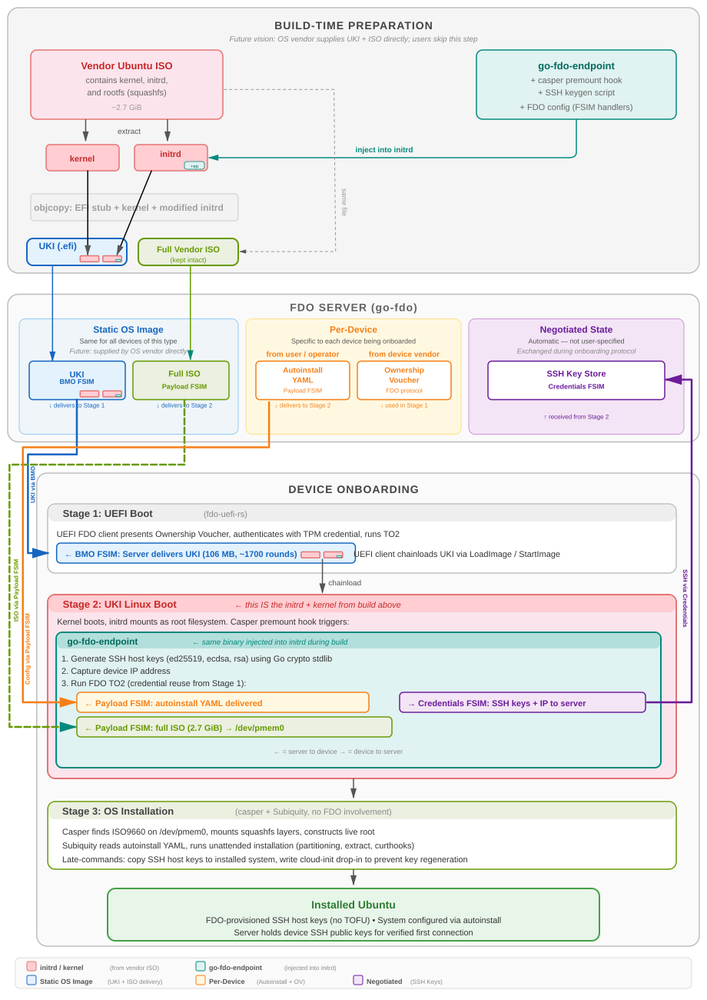

# FDO UKI Build Pipeline

Zero-touch Ubuntu provisioning using FIDO Device Onboard (FDO) and Unified Kernel Images (UKI).



## How It Works

This pipeline solves the problem of securely onboarding a bare-metal device with no pre-installed OS, no bootloader, and no trusted network — using only UEFI firmware and a TPM.

**Build time:** We crack open a standard vendor Ubuntu ISO, extract its kernel and initramfs, inject an FDO device agent ([go-fdo-endpoint](../go-fdo-endpoint)) and casper hooks into the initramfs, and reassemble everything into a single EFI binary (UKI) using `objcopy`. The original ISO is kept intact as a separate asset. In the future, the OS vendor (e.g. Canonical) would supply the UKI and ISO directly — end users would never need to run this build pipeline.

**Server setup:** The FDO server ([go-fdo](../go-fdo)) is loaded with four things, each serving a different role:

| Asset | Scope | Source | FSIM |
|-------|-------|--------|------|
| **UKI** | Static — same for all devices | OS vendor (or build pipeline) | BMO |
| **Full vendor ISO** | Static — same for all devices | OS vendor (or build pipeline) | Payload |
| **Autoinstall YAML** | Per-device — machine-specific config | Operator-specified | Payload |
| **Ownership Voucher** | Per-device — device identity | Device manufacturing (DI) | FDO protocol |

SSH host keys are not loaded onto the server — they are **negotiated automatically** during onboarding via the Credentials FSIM. The server stores them for later verification.

**Device onboarding** happens in three stages with no manual intervention:

1. **Stage 1 (UEFI):** The device's UEFI FDO client ([fdo-uefi-rs](../fdo-uefi-rs)) presents its Ownership Voucher, authenticates via TPM, runs FDO TO2, and receives the UKI via **BMO FSIM** (Bare Metal Onboarding). It chainloads the UKI into Linux.

2. **Stage 2 (Linux/initrd):** The go-fdo-endpoint in the UKI's initramfs generates SSH host keys, then runs FDO TO2 (credential reuse). The server delivers the autoinstall YAML and streams the full ISO to `/dev/pmem0` via **Payload FSIM**. The endpoint sends the SSH host keys and device IP back to the server via **Credentials FSIM**.

3. **Stage 3 (Install):** Casper (Ubuntu's live boot system) finds the ISO on `/dev/pmem0`, mounts the squashfs, and hands off to Subiquity for unattended installation. Late-commands copy the FDO-generated SSH keys to the installed system and prevent cloud-init from regenerating them.

**Result:** A fully installed Ubuntu system whose SSH host keys were generated during onboarding and registered with the FDO server — eliminating the Trust On First Use (TOFU) problem. The operator can verify the device's identity on first SSH connection.

See [TEST-UBUNTU-UKI.md](TEST-UBUNTU-UKI.md) for verified flows and [TODO-UBUNTU-UKI.md](TODO-UBUNTU-UKI.md) for phased installer work.

## Development Philosophy

**All development and building happens on the build host.** This is the source-of-truth for code, tools, and git repos. After building, we copy required components to deployment targets (QEMU test hosts, edge devices, etc.).

## Overview

The UKI is built from the Ubuntu mini-ISO and includes:
- Ubuntu 7.0.0-14-generic kernel
- Full Ubuntu initramfs (91MB)
- Custom init script for Stage 1 boot
- go-fdo-endpoint binary for Stage 2 FDO onboarding
- config_generic.yaml for FSIM handler configuration

## Architecture

### Stage 1 (UEFI)
- fdo-uefi-rs UEFI client boots from flash
- Reads TPM credentials
- Runs TO2 against FDO server
- Receives UKI via BMO inline delivery (~127MB, ~1,957 rounds)
- Chainloads UKI via EFI LoadImage/StartImage

### Stage 2 (Linux)
- UKI boots Linux with custom init
- Init mounts filesystems, starts udevd, configures DHCP
- go-fdo-endpoint reads TPM credentials (same as Stage 1)
- Runs TO2 against FDO server (with `-reuse-cred`)
- Receives sysconfig params and file payloads via FSIMs
- Handlers process the configuration
- New credentials written to TPM NV

## Building

### Simple UKI (mini-ISO)

Prerequisites:
- Ubuntu mini-ISO placed in `assets/` (or set `MINI_ISO_URL` in `config/simple-uki.env`)
- go-fdo-endpoint binary: `assets/fdo-endpoint` (built from go-fdo-endpoint with `-tags=tpm`)
- objcopy, cpio, gzip, mount

```bash
# Build go-fdo-endpoint
cd ../go-fdo-endpoint
go build -tags=tpm -o ../fdo-uki-build/assets/fdo-endpoint .

# Build the UKI
./build-uki.sh
```

This will:
1. Extract kernel and initrd from the mini-ISO
2. Unpack the initrd
3. Inject init script, fdo-endpoint, and config from `rootfs-simple/`
4. Repack the initrd
5. Build UKI with objcopy
6. Optionally deploy to `$DEPLOY_HOST` (set in `config/simple-uki.env`)

Output: `firmware/ubuntu-installer-fdo.efi`

### Full Ubuntu Installer UKI

The installer path builds a UKI from the Ubuntu 26.04.1 LTS live-server ISO:

```bash
./build-ubuntu-installer-uki.sh
```

It downloads and verifies the pinned ISO (config in `config/ubuntu-installer.env`), extracts the matching kernel/initrd, preserves native casper, injects the FDO premount hook and TPM endpoint, reserves `/dev/pmem0`, and builds:

```text
firmware/ubuntu-26.04.1-live-server-fdo.efi
```

To deploy to a test host after building:

```bash
DEPLOY=1 DEPLOY_HOST=<hostname> ./build-ubuntu-installer-uki.sh
```

The verified end-to-end flow:

1. FDO TO1/TO2 with credential reuse and TPM-backed identity
2. SSH host keys generated and transmitted to server via Credentials FSIM
3. Autoinstall YAML delivered via `application/vnd.canonical.autoinstall+yaml`
4. Full 2.728 GiB Ubuntu ISO streamed to `/dev/pmem0`
5. Casper mounts ISO, squashfs layers construct live root
6. Subiquity reads `/autoinstall.yaml` via `subiquity.autoinstallpath`
7. Unattended installation: partitioning, extract, curthooks, late-commands
8. Late-commands copy FDO SSH host keys to target, disable cloud-init key regeneration
9. VM powers off; installed qcow2 boots to `fdo-installed` login prompt
10. SSH host keys on installed system match FDO-registered keys exactly

**Current Status (2026-09-11)**:
- FDO onboarding (TO1/TO2) with credential reuse works
- Ubuntu ISO streaming to /dev/pmem0 works
- Autoinstall.yaml delivery via FDO works
- Subiquity autoinstall triggers and completes unattended installation
- SSH host keys generated in initramfs (Go implementation)
- SSH host keys transmitted to server via FDO Credentials FSIM
- SSH host keys preserved on installed system (cloud-init key regeneration disabled)
- Installed VM SSH keys verified to match FDO-registered keys exactly
- Installed VM boots to `fdo-installed` login prompt

See `TEST-UBUNTU-UKI.md` for hashes/results and `TODO-UBUNTU-UKI.md` for production hardening work.

## Theory of Operation: Installer UKI Build

This section describes what `build-ubuntu-installer-uki.sh` does — how we crack open the Ubuntu ISO, modify its initramfs, and reassemble everything into a single EFI binary that the UEFI FDO client can chainload.

### Why a UKI?

FDO Stage 1 (fdo-uefi-rs) runs in UEFI with no filesystem, no disk, and no OS. It can only chainload an EFI binary. A UKI packages the Linux kernel, initramfs, and kernel command line into a single `.efi` file that UEFI can load directly — no bootloader required. The FDO owner delivers this UKI as a BMO (Bare Metal Onboarding) payload.

### Step 1: Download and Verify the Ubuntu ISO

The script downloads the pinned Ubuntu 26.04.1 LTS live-server ISO (2.728 GiB) and verifies its SHA-256 hash and file size. The ISO URL, hash, and size are pinned in `config/ubuntu-installer.env`. This ISO is not embedded in the UKI — it will be streamed to the device separately during onboarding (see Phase 4 in TODO).

### Step 2: Extract the Kernel and Initramfs

The ISO is loop-mounted read-only and we extract:
- `/casper/vmlinuz` — the Ubuntu kernel
- `/casper/initrd` — the Ubuntu initramfs (concatenated cpio archives)

These are the same kernel/initramfs that Ubuntu's live installer would boot. We use them verbatim (same kernel version, same module set) so that the resulting system is binary-compatible with the ISO's squashfs root.

### Step 3: Unpack the Initramfs

Ubuntu's initramfs is actually three concatenated cpio archives:
1. **`early`** — early microcode updates (Intel/AMD CPU microcode)
2. **`early2`** — firmware blobs needed before the main init
3. **`main`** — the real initramfs with `/init`, busybox, casper scripts, etc.

We use `unmkinitramfs` to split these into separate directory trees (`$ROOTFS_DIR/early`, `$ROOTFS_DIR/early2`, `$ROOTFS_DIR/main`). All modifications go into `main` only.

### Step 4: Inject FDO Components

Into the `main` archive we add:

| Component | Destination | Purpose |
|-----------|-------------|---------|
| `fdo-endpoint` (built from go-fdo-endpoint with `-tags=tpm`) | `/usr/local/bin/fdo-endpoint` | FDO device agent — runs TO2, receives payloads, sends SSH keys |
| `rootfs-installer/etc/fdo/config.yaml` | `/etc/fdo/config.yaml` | Endpoint FSIM configuration (payload destinations, MIME handlers) |
| `rootfs-installer/scripts/casper-premount/20fdo-receive` | `/scripts/casper-premount/20fdo-receive` | Hook that runs FDO onboarding before casper mounts the live media |
| `rootfs-installer/scripts/casper-bottom/62fdo-autoinstall` | `/scripts/casper-bottom/62fdo-autoinstall` | Hook that copies FDO-delivered autoinstall into the live root |
| `rootfs-installer/scripts/generate-ssh-host-keys.sh` | `/scripts/generate-ssh-host-keys.sh` | Generates SSH host keys using fdo-endpoint's `-gen-ssh-keys` |

### Step 5: Patch Casper's ORDER Files

Ubuntu's casper uses `ORDER` files to control hook execution order. We insert our hooks at specific positions:

- **casper-premount/ORDER**: Insert `20fdo-receive` _before_ `20iso_scan`. This runs FDO onboarding to stream the ISO to `/dev/pmem0` before casper tries to find live media.
- **casper-bottom/ORDER**: Insert `62fdo-autoinstall` _before_ `99casperboot`. This copies the autoinstall config into the live root before casper hands off to systemd.

This is critical — simply dropping an executable into the scripts directory is not enough. Casper only runs scripts listed in ORDER.

### Step 6: Reconstruct the Initramfs

The three archives must be reassembled in exact order:
1. `early` and `early2` — repackaged as uncompressed newc cpio archives
2. `main` — repackaged as a gzip-compressed newc cpio archive

The concatenated result replaces the original initramfs. The kernel's initramfs unpacker knows to process multiple concatenated cpio archives.

### Step 7: Compute Kernel Command Line

The command line is computed dynamically:

```
boot=casper ip=dhcp live-media=/dev/pmem0 memmap=2796M!4G nokaslr
autoinstall subiquity.autoinstallpath=/autoinstall.yaml
console=tty0 console=ttyS0
```

Key parameters:
- `memmap=NM!4G` — Reserves N MiB of RAM starting at 4 GiB as a persistent memory region (`/dev/pmem0`). N is computed from the ISO size, rounded up to 4 MiB alignment. This is where the ISO will be streamed to during FDO onboarding.
- `live-media=/dev/pmem0` — Tells casper to look for the live media on `/dev/pmem0` instead of scanning USB/CD.
- `autoinstall` — Triggers Subiquity's unattended install mode.
- `subiquity.autoinstallpath=/autoinstall.yaml` — Points Subiquity directly at the FDO-delivered autoinstall config.

### Step 8: Build the UKI

We use `objcopy` to pack sections into the systemd EFI stub:

| Section | Content | VMA |
|---------|---------|-----|
| `.osrel` | `/etc/os-release` | `0x20000` |
| `.cmdline` | Computed command line | `0x30000` |
| `.linux` | Ubuntu kernel | `0x2000000` |
| `.initrd` | Modified initramfs | Aligned after kernel |

The `.initrd` VMA is computed dynamically: kernel base + kernel size, rounded up to 1 MiB alignment. This is necessary because the initramfs is ~100+ MiB and must not overlap the kernel.

The result is a single `.efi` file (~106 MiB) that UEFI can load and execute directly.

### Runtime Flow

When the UKI boots:

1. UEFI stub loads kernel + initramfs from the PE sections
2. Kernel boots, creates `/dev/pmem0` from the `memmap=` reservation
3. Casper's `ORDER` runs `20fdo-receive` during premount:
   - `generate-ssh-host-keys.sh` creates ed25519/ecdsa/rsa key pairs
   - `fdo-endpoint` runs direct TO2 against the FDO server
   - Server sends autoinstall YAML (small, fast) -> written to `/run/fdo/autoinstall/user-data`
   - Server sends the full ISO (~2.7 GiB) -> streamed to `/dev/pmem0`
   - Endpoint sends SSH host keys + device IP back to server via `fdo.credentials` FSIM
4. Casper's `20iso_scan` finds ISO9660 on `/dev/pmem0`, mounts it
5. Casper mounts squashfs layers, constructs the overlay live root
6. `62fdo-autoinstall` copies autoinstall config to `/root/autoinstall.yaml` (which becomes `/autoinstall.yaml` after root switch)
7. Systemd starts, Subiquity reads `/autoinstall.yaml`
8. Unattended installation runs (partitioning, extraction, late-commands)
9. Late-commands copy SSH keys, write cloud-init preservation config, write completion marker
10. VM powers off

## SSH Host Key Security

### The Problem: Trust On First Use (TOFU)

Standard Ubuntu installation has a fundamental SSH security weakness:

1. The OS installs, cloud-init generates SSH host keys on first boot
2. An operator connects via SSH and sees "The authenticity of host ... can't be established"
3. The operator types "yes" — **blindly trusting** that the key belongs to the intended device

This is the TOFU problem. Between installation and first SSH connection, there is no way to verify the device's identity. A man-in-the-middle could substitute their own host key during this window.

In enterprise/datacenter environments, this is mitigated by controlled networks and out-of-band provisioning. But for edge deployments and zero-touch provisioning, the gap is real — the device may be in an untrusted network with no operator present at first boot.

### The FDO Solution

FDO onboarding provides a cryptographically authenticated channel between the device and the owner service, established before the OS is even installed. We use this channel to solve the TOFU problem:

1. **Generate keys early**: SSH host keys are generated during the installer UKI boot, inside the initramfs, before the OS installation begins. The keys are created using Go's `crypto` stdlib — no `ssh-keygen` binary is needed (the busybox initramfs doesn't have one).

2. **Transmit via FDO**: The keys are sent back to the owner service during TO2 through the `fdo.credentials` FSIM (Registered Credentials flow). This channel is already authenticated by FDO's device attestation (TPM-backed HMAC credential), so the server can trust that the keys genuinely came from the device.

3. **Install permanently**: The autoinstall's late-commands copy the keys from `/run/fdo/ssh-host-keys/` to `/target/etc/ssh/`, overwriting any keys that the installer may have generated.

4. **Prevent regeneration**: A cloud-init drop-in config (`99-fdo-preserve-ssh-keys.cfg`) is written with `ssh_deletekeys: false` and `ssh_genkeytypes: []`. Without this, cloud-init's `cc_ssh` module would delete the FDO-provided keys and generate new ones on first boot, defeating the entire purpose.

5. **Verify on connect**: The owner service now has the device's SSH host public keys. It can construct a `known_hosts` entry and verify the device's identity on the first SSH connection — no TOFU required.

### What Gets Transmitted

During TO2, the `fdo.credentials` FSIM sends:
- `ssh_host_ed25519_key.pub` — ED25519 public key
- `ssh_host_ecdsa_key.pub` — ECDSA (P-256) public key
- `ssh_host_rsa_key.pub` — RSA (3072-bit) public key
- Device IP address — for convenience (the operator can locate the device)

The private keys never leave the device.

### Implementation Details

The SSH key flow spans three repos:

| Repo | Component | Role |
|------|-----------|------|
| `go-fdo-endpoint` | `ssh_host_keygen.go` | Generates ed25519/ecdsa/rsa key pairs in OpenSSH format (uses `golang.org/x/crypto/ssh`) |
| `go-fdo-endpoint` | `credentials_device.go` | Registers `CredentialsDevice` FSIM module, reads keys from `/run/fdo/ssh-host-keys/` |
| `go-fdo-endpoint` | `main.go` | `-gen-ssh-keys <dir>` flag to generate keys; wires `fdo.credentials` module |
| `go-fdo` | `fsim/credentials_device.go` | Core FSIM logic: receives `pubkey-request` from owner, sends `pubkey-begin/data/end` inline in `Receive()` |
| `go-fdo` | `fsim/credentials_owner.go` | Server-side: sends `pubkey-request`, receives key data, sends `pubkey-result` ack |
| `fdo-uki-build` | `generate-ssh-host-keys.sh` | Initramfs script that calls `fdo-endpoint -gen-ssh-keys /run/fdo/ssh-host-keys` |
| `fdo-uki-build` | `autoinstall-test.yaml` | Late-commands: copy keys to target, write cloud-init preservation config |

### Server-Side Key Reception: Protocol and Data Flow

The server initiates the key exchange via the `-request-pubkey` flag on the FDO server CLI:

```bash
fdo server ... -request-pubkey "device_info:device_info"
```

The format is `type:id` where `id` must match what the device expects (the endpoint's `RegisterCredentialsDevice` checks for `credentialID == "device_info"`). This causes `CredentialsOwner` to send a `pubkey-request` during TO2 ServiceInfo.

**Protocol sequence (during TO2 ServiceInfo exchange):**

```
Server -> Device:  fdo.credentials:active = true
Server -> Device:  fdo.credentials:pubkey-request = CBOR{-1: "device_info", -2: 1}
Device -> Server:  fdo.credentials:pubkey-begin = CBOR{length, credential_id, type, ...}
Device -> Server:  fdo.credentials:pubkey-data = <chunk(s) of JSON payload>
Device -> Server:  fdo.credentials:pubkey-end = CBOR{}
Server -> Device:  fdo.credentials:pubkey-result = CBOR{status: 0, message: "..."}
Server -> Device:  fdo.credentials:active = false
```

**What the device sends** (assembled in `go-fdo-endpoint/credentials_device.go`):

The device bundles all SSH public keys and its IP address into a single JSON blob — one round-trip instead of separate requests per key type:

```json
{
  "ssh_host_ed25519_key": "ssh-ed25519 AAAA... fdo-device-host-key",
  "ssh_host_ecdsa_key": "ecdsa-sha2-nistp256 AAAA... fdo-device-host-key",
  "ssh_host_rsa_key": "ssh-rsa AAAA... fdo-device-host-key",
  "ip_address": "10.0.2.15"
}
```

The public keys are read from `/run/fdo/ssh-host-keys/*.pub` and the IP from `/run/fdo/device-ip.txt` (captured before TO2 by the casper-premount hook).

**What the server does with it** (in `go-fdo/examples/cmd/server.go`):

The `OnPublicKeyReceived` callback prints the received data to stdout:

```
[fdo.credentials] Received public key registration:
  ID:   credential-5
  Type: 0
  Key:  {"ssh_host_ed25519_key":"ssh-ed25519 AAAA...","ip_address":"10.0.2.15"} (length: 950 bytes)
```

**Current limitation:** The server only logs the received keys to stdout (which ends up in `server.log`). There is no persistence -- no database storage, no `known_hosts` file generation, no webhook. For testing, we extract the keys from `server.log` with `grep` to build a `known_hosts` file and verify the SSH connection. Production use would need the `OnPublicKeyReceived` callback to write to a database or known_hosts file.

### Connecting to an Onboarded Device

After FDO onboarding completes, the server log contains the device's SSH host keys. To connect securely (proving you are talking to the machine that was onboarded, not an impostor):

**1. Extract the host key from the server log:**

```bash
# Find the credentials registration in the server log
grep -A5 'fdo.credentials.*Received public key' server.log.raw
```

This will show the JSON blob with `ssh_host_ed25519_key`, `ssh_host_ecdsa_key`, `ssh_host_rsa_key`, and `ip_address`.

**2. Add the host key to known_hosts:**

```bash
# Remove any stale key for this IP (if reinstalled)
ssh-keygen -f ~/.ssh/known_hosts -R <DEVICE_IP>

# Add the FDO-received host key (use any of the three key types)
echo "<DEVICE_IP> ecdsa-sha2-nistp256 AAAA..." >> ~/.ssh/known_hosts
```

**3. Connect with the onboarding key:**

```bash
ssh -i config/fdo-onboarding-key fdo@<DEVICE_IP>
```

If the connection succeeds without a host key warning, you have cryptographic proof that:
- The device on the other end holds the private half of the host key
- That host key was generated during FDO onboarding and transmitted through the authenticated TO2 channel
- No TOFU -- the device identity was verified through the FDO ownership chain, not blind trust

The `fdo-onboarding-key` (in `config/`) is the SSH user key whose public half is baked into the autoinstall YAML. Password auth is disabled (`allow-pw: false`).

### Key Technical Gotcha: FDO 2.0 Yield() vs Receive()

The Credentials FSIM was originally written assuming device modules could send data via `Yield()` (the "I have data to send" callback). This works in FDO 1.01 but **FDO 2.0's `exchangeServiceInfo20` never calls `Yield()`**. Any data that must be sent in response to an owner message must be written inside `Receive()` using the `respond` callback. This was the root cause of the "Credentials FSIM disabled" issue that blocked SSH key transmission for several days.

### Key Technical Gotcha: Cloud-init Key Regeneration

Cloud-init's `cc_ssh` module runs on every boot and, by default:
1. Deletes all existing SSH host keys (`ssh_deletekeys: true`)
2. Generates new keys for configured types (`ssh_genkeytypes: [ed25519, ecdsa, rsa]`)

Simply copying keys to `/etc/ssh/` is not enough — cloud-init will overwrite them on first boot. The fix is a drop-in config file in `/etc/cloud/cloud.cfg.d/` that sets both `ssh_deletekeys: false` and `ssh_genkeytypes: []`. Note: `ssh_genkeymodes` (which appeared in some documentation) is **not a valid cloud-init key** and is silently ignored.

## Golden Reference

The current working UKI (built manually before this script) is preserved as a reference:
- Path: `golden/ubuntu-installer-fdo-stage2-verified-2026-09-03.efi`
- Size: ~122MB
- Kernel: 7.0.0-14-generic
- Initrd: ~106MB compressed
- Verified: Stage 1 + Stage 2 end-to-end (2026-09-03)

## Testing

### End-to-End Test

The `test-installer-pe2.sh` script runs the full onboarding flow on a QEMU test host:

```bash
# On the test host (requires swtpm, qemu, server-installer, quick-di-tpm)
./test-installer-pe2.sh
```

All paths are configurable via environment variables (`FDO_SERVER`, `FDO_QUICK_DI`, `FDO_EFI_DISK`, `FDO_FIRMWARE_DIR`). See the script header for details.

### Boot Installed VM

```bash
./boot-installed-vm.sh /tmp/fdo-installer-test-<timestamp>/target.qcow2
```

## Configuration

### Kernel Cmdline

- `console=tty0` — Video console (VNC)
- `console=ttyS0` — Serial console

### go-fdo-endpoint Config

Located at `/etc/fdo/config_generic.yaml` in the initrd (simple UKI) or `/etc/fdo/config.yaml` (installer UKI):
- FDO version: 200
- DI URL: `http://10.0.2.2:8080`
- Crypto: A128GCM, ECDH256
- Handlers: sysconfig (hostname, timezone, ntp-server), payload (json, octet-stream, text)

### Server Flags

- `-rv-bypass` — Skip rendezvous (direct TO2)
- `-reuse-cred` — Enable credential reuse protocol
- `-bmo` — Send UKI via BMO inline
- `-sysconfig` — Send sysconfig parameters
- `-payload` — Send file payloads
- `-bmo-duration <seconds>` — Advisory estimated time for BMO image transfer+apply (see below)
- `-payload-duration <seconds>` — Advisory estimated time for payload transfer+apply (see below)

### Estimated Duration (Watchdog Advisory)

Large payloads (e.g. a 2.8 GiB ISO image or a 106 MB UKI) can take a long time to transfer and apply over FDO ServiceInfo. Devices typically run internal watchdog timers during onboarding to recover from hangs. If a legitimate transfer exceeds the watchdog timeout, the device will reboot mid-transfer — a silent failure that looks like a hardware or network problem.

The `-bmo-duration` and `-payload-duration` server flags let the operator specify an advisory `estimated_duration` (in seconds) that is sent to the device in the `payload-begin` / `image-begin` message. The device MAY use this to extend its watchdog accordingly (the reference fdo-uefi-rs client doubles the value for safety margin and re-arms only if the result exceeds its default timeout).

**Who sets this value?** The estimate has two components:

1. **Apply time** — how long the device takes to process the payload after receiving it (e.g. running an installer). The person who authors the payload knows this best.
2. **Transfer time** — how long it takes to deliver the payload over the wire. This depends on payload size and link speed, which the sysadmin deploying the server knows best.

The operator should add both together. For example, a 2.8 GiB ISO on a 100 Mbit/s link takes ~240s to transfer, plus ~300s for the Ubuntu installer to run — so `-payload-duration 540` would be reasonable. On a slower 10 Mbit/s link the same ISO takes ~2400s, so `-payload-duration 2700`.

A value of 0 (the default) means "do not send this field" — the device uses its built-in default watchdog.

**Example:**

```bash
# BMO stage: 106MB UKI, fast link, ~30s transfer + trivial chainload
./fdo-server serve ... -bmo-duration 60

# Payload stage: 2.8GB ISO, moderate link, ~5 min transfer + ~5 min install
./fdo-server serve ... -payload-duration 600
```

## Troubleshooting

### TPM Socket Issues

QEMU 10.2.1 has compatibility issues with swtpm sockets. Use the full test script instead of running QEMU separately.

### Credential Reuse

Ensure the server has `-reuse-cred` flag. Without it, go-fdo-endpoint will generate a new credential each time, breaking the multi-stage flow.

### VNC Connection

VNC display is configurable via `VNC_DISPLAY` environment variable. If connection fails, check that QEMU is running:
```bash
ps aux | grep qemu
```

## Files

- `build-uki.sh` — Simple UKI build (mini-ISO kernel, custom init, small payloads)
- `build-ubuntu-installer-uki.sh` — Full Ubuntu installer UKI build (live-server ISO kernel/initramfs)
- `test-installer-pe2.sh` — End-to-end test: TPM init, FDO server, QEMU, autoinstall, verification
- `boot-installed-vm.sh` — Boot an installed qcow2 for manual inspection
- `config/ubuntu-installer.env` — Pinned ISO URL, hash, size, UKI filename
- `config/simple-uki.env` — Simple UKI build configuration (mini-ISO name, deploy target)
- `config/autoinstall-test.yaml` — Test autoinstall config (hostname, user, SSH, late-commands)
- `rootfs-simple/` — Overlay files for the simple UKI build:
  - `init` — Custom init script (mounts filesystems, DHCP, runs fdo-endpoint)
  - `etc/fdo/config_generic.yaml` — Endpoint FSIM config (sysconfig, payload handlers)
- `rootfs-installer/` — Overlay files for the installer UKI build:
  - `etc/fdo/config.yaml` — Endpoint FSIM config (payload destinations, MIME handlers)
  - `scripts/casper-premount/20fdo-receive` — FDO onboarding hook (keygen, TO2, ISO streaming)
  - `scripts/casper-bottom/62fdo-autoinstall` — Copies autoinstall into live root
  - `scripts/generate-ssh-host-keys.sh` — SSH key generation wrapper
- `golden/` — Golden reference UKIs (preserved, not modified)
- `README.md` — This file
- `TEST-UBUNTU-UKI.md` — Verified test results and hashes
- `TODO-UBUNTU-UKI.md` — Phased work tracker
