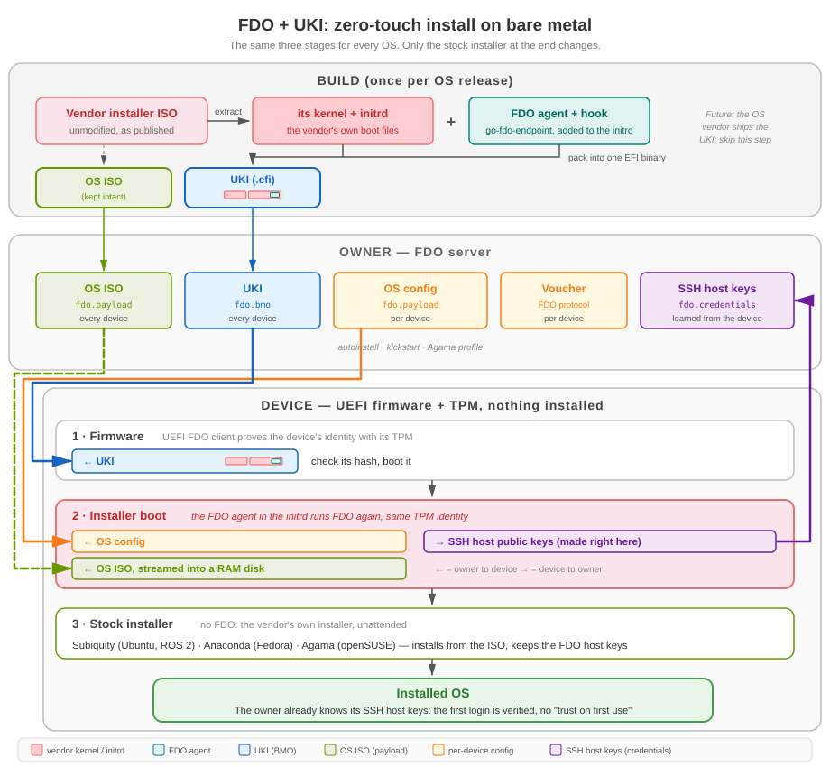

# FDO UKI Build Pipeline

Zero-touch OS installation on bare metal, using FIDO Device Onboard (FDO) and Unified Kernel Images (UKI).

A device has only UEFI firmware, a TPM, and the FDO credential from manufacturing. It powers on, proves its identity to its owner, downloads the vendor's own installer, and installs itself unattended. The result is an installed OS whose SSH host keys the owner already knows, so even the first login is verified.



## Supported Targets

Each target has its own guide, with a detailed architecture diagram, build steps and theory of operation.

| Target | Stock installer | Per-device config | UKI / ISO | Verified (QEMU) | Guide |
| --- | --- | --- | --- | --- | --- |
| **Ubuntu 26.04.1 LTS** live server | Subiquity (casper) | autoinstall YAML | 106 MiB / 2.7 GiB | 2026-09-11 | [README-UBUNTU.md](README-UBUNTU.md) |
| **Fedora 44** Server DVD | Anaconda | kickstart | 277 MiB / 3.6 GiB | 2026-09-30 | [README-FEDORA.md](README-FEDORA.md) |
| **openSUSE Leap 16.0** offline | Agama (live ISO) | Agama JSON profile | 125 MiB / 4.2 GiB | 2026-10-05 | [README-OPENSUSE.md](README-OPENSUSE.md) |
| **ROS 2 Lyrical** on Ubuntu 26.04.1 | Subiquity + offline ROS 2 apt bundle | autoinstall YAML | 106 MiB / 2.7 GiB + 132 MiB bundle | 2026-10-07 | [README-ROS2.md](README-ROS2.md) |

Every target has a `TEST-<OS>-UKI.md` (findings, hashes, timings) and a `TODO-<OS>-UKI.md` (phased work tracker).

## How It Works

The same three stages run for every target. Only the plumbing around the stock installer differs.

**Build (once per OS release).** Take the vendor's installer ISO and extract its kernel and initramfs. Add the FDO device agent ([go-fdo-endpoint](../go-fdo-endpoint)) and a small boot hook to the initramfs. Pack kernel, initramfs and command line into one EFI binary, the UKI. The ISO itself is left untouched. Eventually the OS vendor would ship the UKI and nobody would need to run this pipeline.

**Owner.** The FDO server ([go-fdo](../go-fdo)) holds:

| Asset | Scope | Delivered with |
| --- | --- | --- |
| **UKI** | same for every device of a type | `fdo.bmo` (Bare Metal Onboarding) |
| **Vendor ISO** | same for every device of a type | `fdo.payload` |
| **OS config** (autoinstall / kickstart / Agama profile) | per device | `fdo.payload`, sent before the ISO |
| **Ownership voucher** + rendezvous blob | per device | FDO protocol |

SSH host keys aren't loaded onto the server: the device generates them and sends the public halves back with `fdo.credentials`.

**Device.**

1. **Firmware.** The UEFI FDO client ([fdo-uefi-rs](../fdo-uefi-rs)) authenticates with its TPM credential (TO1 → TO2). It receives the UKI over `fdo.bmo`, checks its hash, and boots it.
2. **Installer boot.** Inside the vendor's initramfs, go-fdo-endpoint generates SSH host keys and runs FDO again with the same TPM credential (credential reuse). It receives the OS config, streams the whole ISO into a RAM disk, and returns the SSH public keys.
3. **Stock installer.** The vendor's own installer finds the ISO on the RAM disk and runs the delivered config unattended. It copies the FDO-generated host keys into the installed system, then powers off. FDO plays no part in this stage.

## Key Ideas

### Why a UKI?

FDO Stage 1 (fdo-uefi-rs) runs in UEFI with no filesystem, no disk, and no OS. It can only chainload an EFI binary. A UKI packages the Linux kernel, initramfs, and kernel command line into a single `.efi` file that UEFI can load directly — no bootloader required. The FDO owner delivers this UKI as a BMO (Bare Metal Onboarding) payload.

### The ISO lives in a RAM disk

The UKI's command line contains `memmap=<N>M!4G`, which reserves RAM above 4 GiB as a persistent-memory region. N is computed from the ISO's size. The kernel exposes the region as `/dev/pmem0`, a block device. go-fdo-endpoint streams the ISO payload straight into it, in constant memory, and the FDO payload hash is checked. The installer then boots from `/dev/pmem0` as if it were a USB stick or DVD. So the ISO is never modified, and the device needs no local media.

### One identity, several FDO sessions

Both stages, and optionally a management agent after installation, use the **same TPM device credential**. The server's `-reuse-cred` keeps it valid across sessions. Each stage asks only for the FSIMs it understands, so the firmware never sees the ISO and the installer never sees the UKI.

### Rendezvous (TO0/TO1)

Neither stage has the owner's address baked in. Both read the RV info from the TPM credential written at DI and run TO1 to learn where TO2 is. The owner must therefore register an RV blob (TO0) for the device's GUID, with the TO2 address as the device sees it. In QEMU user networking that's `10.0.2.2:8080`. The Fedora, openSUSE and ROS 2 test harnesses (`test-*-installer.sh`) do this right after starting the server:

```bash
server server -db fdo.db -to0 http://127.0.0.1:8080 -to0-guid <GUID> -ext-http 10.0.2.2:8080
```

This matters more than it seems. go-fdo-endpoint (Stage 2) only reaches TO2 through a TO1 blob or an RV *bypass* directive, so without TO0 it fails with `all TO2 attempts failed`. The UEFI client in Stage 1 happens to fall back to direct TO2, which can hide the problem. With credential reuse the blob survives Stage 1's TO2 and serves Stage 2 as well.

### SSH host keys without "trust on first use"

The host keys are created in Stage 2, before the OS exists, and their public halves travel to the owner inside the authenticated TO2 session. The installer then installs exactly those keys. So the owner can write `known_hosts` before the device ever boots its new OS. Details: [doc/SSH-HOST-KEYS.md](doc/SSH-HOST-KEYS.md).

### Beyond installation: a managed edge system

If the installed OS includes a management agent, the agent runs FDO one more time at first boot. It receives its credential and its management-service URL, and the device goes straight from bare metal into service. Details and diagram: [doc/MANAGED-EDGE.md](doc/MANAGED-EDGE.md).

## Quick Start

All targets follow the same pattern:

```bash
# Build host: fetch + verify the pinned ISO, build the UKI (and any extra payloads)
GO_ROOT=/path/to/go1.25 ./build-<os>-installer-uki.sh

# ...and copy the UKI, ISO and test config to a QEMU test host
DEPLOY=1 DEPLOY_HOST=<test-host> ./build-<os>-installer-uki.sh

# Test host: DI with a software TPM, FDO server, TO0, then boot the device VM
./test-<os>-installer.sh

# Boot the installed disk for inspection
./boot-installed-vm.sh <test-workdir>/target.qcow2
```

`<os>` is `ubuntu`, `fedora`, `opensuse` or `ros2`. The Ubuntu path's older harness is `test-installer-pe2.sh`. The test host needs `swtpm`, `qemu-system-x86_64`, OVMF, the FDO server (`go-fdo` `examples/cmd`), `quick-di-tpm` (`go-fdo-quick-di`), and the UEFI client disk `efi-disk-release.img` (`fdo-uefi-rs`). Paths are set with environment variables; see each script's header.

**All development and building happens on the build host.** This is the source-of-truth for code, tools, and git repos. After building, we copy required components to deployment targets (QEMU test hosts, edge devices, etc.).

## Repository Layout

- `build-<os>-installer-uki.sh`, `test-<os>-installer.sh`: builder and end-to-end test harness per target
- `config/`: pinned ISO URLs/hashes (`*-installer.env`) and test configs (autoinstall, kickstart, Agama profile)
- `rootfs-*/`: the files each builder adds to the vendor initramfs
- `README-<OS>.md`, `TEST-<OS>-UKI.md`, `TODO-<OS>-UKI.md`: per-target guide, results and work tracker
- `doc/`: diagrams, plus the cross-cutting deep dives:
  - [doc/SSH-HOST-KEYS.md](doc/SSH-HOST-KEYS.md): TOFU, the Credentials FSIM exchange, connecting to an onboarded device
  - [doc/MANAGED-EDGE.md](doc/MANAGED-EDGE.md): BMO + OS install + management agent → fully managed edge system
  - [doc/REFERENCE.md](doc/REFERENCE.md): endpoint config, server flags, watchdog duration advisory, troubleshooting
- `build-uki.sh`, `rootfs-simple/`, `golden/`: the original simple two-stage UKI and its golden reference (see [README-UBUNTU.md](README-UBUNTU.md#simple-uki-mini-iso-the-original-two-stage-proof-of-concept))
